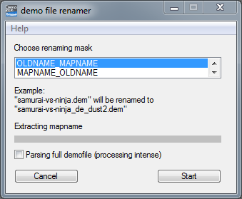

# demo file renamer

**What can this Tool do?**  
This tool was manly made to extract out the mapname of
GoldSrc- and Source Engine demofiles and place it in the name of the demofile itself.

**Which kind of demofiles this tool can handle?**  
Currently this tool support Counter-Strike 1.6, Counter-Strike Source,
Counter-Strike Global Offensive and Team Fortress 2 demofiles.

**How to use?**
1. Select your renaming mask you want
2. Press start and select in the following window your folder with the supported demofiles
    (please note, all demofiles with the ending "dem" in this folder will be renamed, subfolder
    are not included).
    In a protected folder (like "ProgramFiles") you have to start this program in admin mode!
3. Press OK and wait until you will hopefully be happy :)

**Option Info:**  
Parsing full demofile: This option is recommended for old demofiles (CS 1.6 etc.),
because it was able to record into the same file when a mapchange occur. So the hole
file have to be read to detect all played maps in one file. This was fixed in newer
games (CS:GO etc.), so it isn't necessary there. Use this option if you are unsure.

# Screenshots

